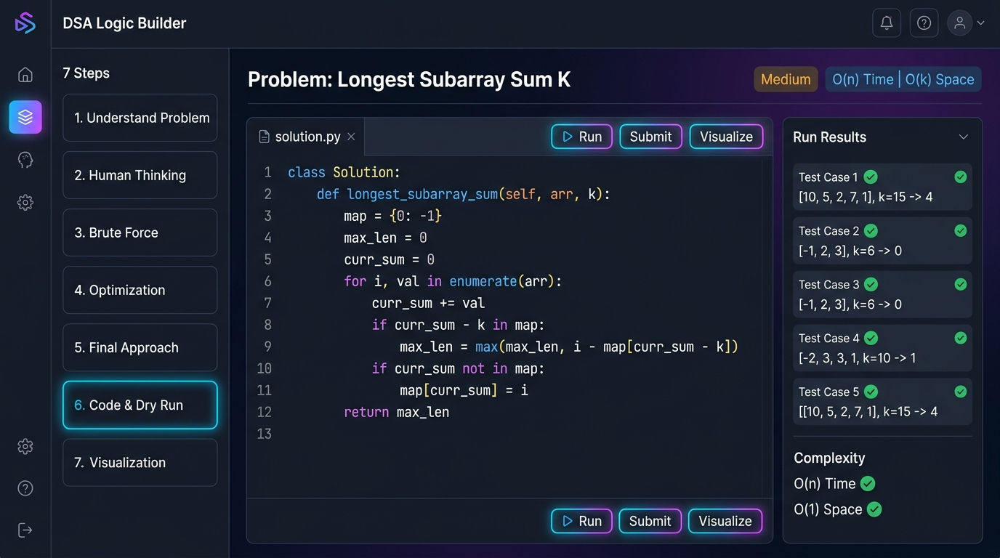
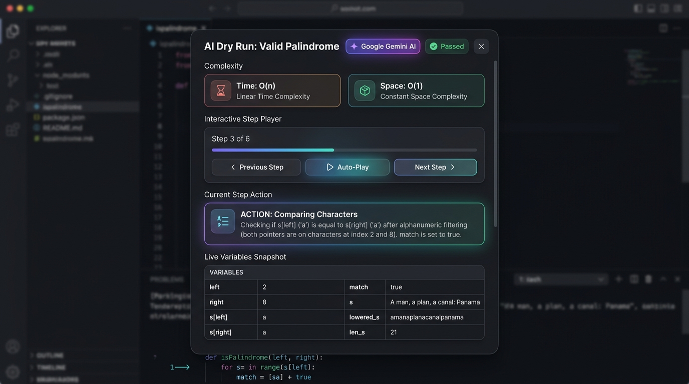

# 🧠 DSA Logic Builder

<div align="center">

[](https://reactjs.org/)
[](https://www.typescriptlang.org/)
[](https://vitejs.dev/)
[](https://tailwindcss.com/)
[](https://nodejs.org/)
[](https://expressjs.com/)
[](https://www.mysql.com/)
[](https://aistudio.google.com/)
[](LICENSE)

<br/>

**Transform algorithmic problem-solving from rote memorization into deep, intuitive logic.**  
*A modern full-stack web application designed to guide developers step-by-step through algorithmic thinking, dynamic visual simulations, and AI-powered execution traces.*

<br/>



<br/><br/>

[Explore Features](#-key-features) • [How It Works](#-how-it-works) • [7-Step Framework](#-the-7-step-logic-framework) • [Quickstart](#-getting-started) • [Deployment](#-deployment)

</div>

---

## 🌟 Why DSA Logic Builder?

Most competitive programmers struggle not because they don't know syntax, but because they **jump straight to code without understanding the underlying thought process**.

When faced with a complex problem in technical interviews, leaping into syntax causes syntax panic, unhandled edge cases, and off-by-one errors.

**DSA Logic Builder** solves this by enforcing a disciplined **7-step structured problem-solving methodology**, augmented with an **AI Code Dry Run engine powered by Google Gemini**, visual algorithm animations, company interview tracks, and streak analytics.

---

## 📖 How It Works

DSA Logic Builder guides you from an ambiguous problem description all the way to an optimized, bug-free implementation through an intuitive workflow:

```
┌─────────────────┐     ┌──────────────────┐     ┌─────────────────┐
│ 1. Select Topic │ ──▶ │ 2. Mental Ladder │ ──▶ │ 3. Code Solution│
│ Company/Pattern │     │ 7-Step Logic Flow│     │ Python/JS/Java  │
└─────────────────┘     └──────────────────┘     └────────┬────────┘
                                                          │
                        ┌──────────────────┐              │
                        │ 5. Visualizer &  │ ◀────────────┼──────────────┐
                        │ Data Structures  │              ▼              ▼
                        └──────────────────┘     ┌────────────────┐ ┌──────────┐
                                                 │ 4. AI Dry Run  │ │ LeetCode │
                                                 │ Gemini Tracing │ │  Export  │
                                                 └────────────────┘ └──────────┘
```

### Step 1: Select Your Problem or Pattern
Browse categorized problem banks by **algorithmic pattern** (e.g. *Sliding Window*, *Two Pointers*, *Fast & Slow Pointers*, *Monotonic Stack*) or by **target company** (*Google*, *Amazon*, *Meta*, *Microsoft*, *Apple*, *Uber*).

### Step 2: Ascend the 7-Step Logic Progression
Instead of opening an empty code editor, you are guided through the cognitive ladder:
1. **Understand Problem**: Identify input/output types, numerical limits, and potential edge cases.
2. **Human Thinking**: Walk through example cases on paper to identify human patterns before writing algorithms.
3. **Brute Force**: Construct the naive solution, determine its theoretical time/space bounds, and identify why it's too slow.
4. **Optimization**: Pinpoint redundant operations and apply optimal data structures (e.g. hash map lookup in $O(1)$ instead of nested loops in $O(n^2)$).
5. **Final Approach**: Formulate concrete pseudocode, invariant checks, and step-by-step procedural steps.

### Step 3: Implement Code & Trigger AI Dry Run
Write your solution in **Python 3**, **JavaScript**, **Java**, or **C++**. 

<div align="center">
  
</div>

Click **`✨ AI Dry Run`** to inspect the inner workings of your code:
- **Variable Inspector**: Watch how each variable, pointer, and hash map mutates on every single iteration.
- **Interactive Player**: Step forward, step backward, or auto-play through execution steps.
- **Asymptotic Complexity**: Instant calculation of time ($O$) and space ($O$) complexity.
- **Edge-Case & Bug Warning**: Identifies any boundary condition risks before submitting.

### Step 4: Step-by-Step Algorithm Visualization
Switch to **Step 7 (Visualization)** to watch an interactive visual simulation of your algorithm in action — watching pointers advance across arrays, nodes traverse trees, and stacks push/pop in real-time.

### Step 5: Save, Review, and Build Long-Term Retention
- Solutions, logic scores, and step completions are automatically saved to your **MySQL database**.
- Use the **Spaced Repetition Reviewer** and **Personalized Notes** to revisit tricky problems before big interviews.
- Keep your daily streak alive on the **GitHub-style Contribution Heatmap**.

---

## 🚀 Key Features

### 🧩 The 7-Step Logic Progression
- Step 1: **Understand** (Inputs, Outputs, Constraints)
- Step 2: **Human Thinking** (Intuitive pen-and-paper walkthrough)
- Step 3: **Brute Force** (Naive formulation & complexity bounds)
- Step 4: **Optimization** (Pattern recognition & bottleneck reduction)
- Step 5: **Final Approach** (Pseudocode & invariant verification)
- Step 6: **Code & AI Dry Run** (Multi-language code editor with Gemini AI simulation)
- Step 7: **Visualization** (Animated data structure simulations)

### 🤖 AI-Powered Code Dry Run (Google Gemini)
- **Zero-Setup Fallback**: Operates out-of-the-box with an algorithmic trace engine even without an API key.
- **Deep Gemini AI Integration**: Connect any free Google Gemini API key to simulate any arbitrary code line-by-line using `gemini-3.6-flash`.
- **Live Variable State Inspection**: Real-time snapshot of variables, pointers, and hash maps.
- **One-Click LeetCode Export**: Copies your verified code to your clipboard and opens the exact LeetCode problem page in a new tab.

### 🏢 Company-Specific Question Banks
- Practice targeted problem lists curated for top tech employers: **Google**, **Amazon**, **Meta**, **Microsoft**, **Apple**, and **Uber**.
- Tagged with company interview frequency and difficulty.

### 📊 Performance Analytics & Streaks
- **Activity Heatmap**: Visual log of daily practice consistency.
- **Daily Streak Counter**: Automatically logs active days and tracks longest streaks.
- **Pattern Mastery Radar**: Visual overview of your strengths across major algorithmic patterns.
- **Achievements & Badges**: Unlock milestones as you master new patterns.

### ⏱️ Interview & Productivity Tools
- **Timed Mock Interview Mode**: Practice under realistic interview pressure without hints.
- **Built-in Pomodoro Timer**: 25-minute focused problem-solving sprints.
- **Code Comparison Tool**: Compare naive brute-force implementations side-by-side with optimal solutions.
- **Personalized Notes & Bookmarks**: Annotate problems with key takeaways for quick review.

---

## 🛠️ Architecture & Tech Stack

```
┌─────────────────────────────────────────────────────────────┐
│                    Frontend (Vite + React)                  │
│   Tailwind CSS • shadcn/ui • Radix UI • Lucide • TypeScript  │
└──────────────────────────────┬──────────────────────────────┘
                               │ REST API (JSON / JWT)
┌──────────────────────────────▼──────────────────────────────┐
│                  Backend (Node.js + Express)                │
│    Helmet Security • Express Rate Limit • JWT Auth • CORS   │
└──────────────┬──────────────────────────────┬───────────────┘
               │                              │
               ▼                              ▼
┌──────────────────────────────┐ ┌────────────────────────────┐
│      MySQL Database          │ │     Google Gemini AI       │
│  Users • Progress • Streaks  │ │  gemini-3.6-flash Engine   │
│   Roles • Code Solutions     │ │  Live Execution Simulator  │
└──────────────────────────────┘ └────────────────────────────┘
```

| Layer | Technology | Description |
| :--- | :--- | :--- |
| **Frontend** | React 18, TypeScript, Vite | Fast Single Page Application (SPA) with reactive state |
| **Styling** | Tailwind CSS, shadcn/ui | Modern, responsive, dark/light accessible design system |
| **Backend** | Node.js, Express.js | Secure RESTful API service |
| **Database** | MySQL 8.0+ | Relational schema with transactional consistency |
| **Authentication** | JSON Web Tokens (JWT), bcryptjs | Secure password hashing (12 salt rounds) |
| **AI Engine** | Google Gemini (`gemini-3.6-flash`) | Context-aware code execution and dry run simulation |

---

## 🏁 Getting Started

### Prerequisites
- **Node.js**: v18.0.0 or higher
- **npm**: v9.0.0 or higher
- **MySQL**: 8.0+ (local instance or cloud database like Railway/Aiven)

---

### 1. Clone the Repository

```bash
git clone https://github.com/YOUR_USERNAME/dsa-logic-builder.git
cd dsa-logic-builder
```

### 2. Install Dependencies

```bash
# Install frontend dependencies
npm install

# Install backend dependencies
cd server && npm install && cd ..
```

---

### 3. Configure Environment Variables

#### Backend (`server/.env`)
Create `server/.env` (or copy from `server/.env.example`):

```env
# MySQL Database Configuration
MYSQL_HOST=localhost
MYSQL_PORT=3306
MYSQL_USER=root
MYSQL_PASSWORD=your_mysql_password
MYSQL_DATABASE=dsa_logic_builder

# Authentication Secret (Change for production)
JWT_SECRET=your-random-secret-key-change-in-production

# Server Port & CORS
PORT=3001
CORS_ORIGIN=http://localhost:8080

# Google Gemini AI (Optional - for live AI dry runs)
# Get a free API key at: https://aistudio.google.com/app/apikey
GEMINI_API_KEY=your_gemini_api_key_here
```

#### Frontend (`.env.local` - Optional)
```env
VITE_API_URL=http://localhost:3001
```

---

### 4. Initialize the MySQL Database

Run the database setup script to automatically create the database and tables:

```bash
node server/setup-db.js
```

---

### 5. Launch the Application

Run both frontend and backend concurrently:

```bash
npm run dev:all
```

- **Frontend Application**: `http://localhost:8080`
- **Express API Server**: `http://localhost:3001`
- **API Health Check**: `http://localhost:3001/api/health`

---

## 📡 API Endpoints

### Authentication (`/api/auth`)
| Method | Endpoint | Description | Auth Required |
| :--- | :--- | :--- | :---: |
| `POST` | `/api/auth/signup` | Register a new user | No |
| `POST` | `/api/auth/login` | Authenticate and receive JWT | No |
| `GET` | `/api/auth/me` | Retrieve active user profile | Yes |
| `PUT` | `/api/auth/update-password` | Update current password | Yes |

### Problem Progress (`/api/progress`)
| Method | Endpoint | Description | Auth Required |
| :--- | :--- | :--- | :---: |
| `GET` | `/api/progress` | Get all solved problem records | Yes |
| `GET` | `/api/progress/:problemId` | Get progress for a specific problem | Yes |
| `PUT` | `/api/progress/:problemId` | Save step completion & code solution | Yes |

### AI Dry Run Engine (`/api/ai`)
| Method | Endpoint | Description | Auth Required |
| :--- | :--- | :--- | :---: |
| `POST` | `/api/ai/dryrun` | Perform AI line-by-line simulation & trace | No |

### Streaks & Profiles (`/api/streaks`, `/api/profiles`)
| Method | Endpoint | Description | Auth Required |
| :--- | :--- | :--- | :---: |
| `GET` | `/api/streaks` | Get current user's streak count & history | Yes |
| `POST` | `/api/streaks/checkin` | Record daily activity check-in | Yes |
| `PUT` | `/api/profiles` | Update display name or preferences | Yes |
| `POST` | `/api/profiles/avatar` | Upload profile image (multipart/form-data) | Yes |

---

## 🚀 Deployment

### 1. Deploy Backend & MySQL Database (Railway or Render)
1. Provision a MySQL 8.0 instance on [Railway](https://railway.app) or [Aiven](https://aiven.io).
2. Execute `server/schema.sql` against the database to create all tables.
3. Deploy the `/server` directory to Railway or Render:
   - **Root Directory**: `server`
   - **Start Command**: `node index.js`
   - **Environment Variables**: Add your database credentials, `JWT_SECRET`, `GEMINI_API_KEY`, and set `CORS_ORIGIN` to your frontend domain.

### 2. Deploy Frontend (Vercel)
1. Import your GitHub repository to [Vercel](https://vercel.com).
2. Configure:
   - **Framework Preset**: `Vite`
   - **Root Directory**: `./`
   - **Environment Variable**: `VITE_API_URL=https://your-backend-api.railway.app`
3. Click **Deploy**.

---

## 📂 Project Structure

```
dsa-logic-builder/
├── docs/                   # Documentation and screenshots
│   └── screenshots/        # Workspace & Dry Run preview images
├── public/                 # Static assets and icons
├── server/                 # Express backend
│   ├── middleware/         # JWT authentication and RBAC guards
│   ├── routes/             # Auth, AI Dry Run, Progress, Streaks, Profiles
│   ├── db.js               # MySQL connection pool
│   ├── schema.sql          # Full database schema and indexes
│   ├── setup-db.js         # Automated schema initializer
│   └── index.js            # Express server entry point
├── src/
│   ├── components/
│   │   ├── features/       # Heatmaps, timers, notes, forums, contests
│   │   ├── layout/         # Responsive Navbar, Footer, Page Layouts
│   │   ├── problem/        # 7-Step logic components & DryRunModal
│   │   └── ui/             # Radix UI + Tailwind design components
│   ├── contexts/           # Authentication and subscription state
│   ├── data/               # Curated problems and company tracks
│   ├── hooks/              # Custom hooks (progress, streaks, bookmarks)
│   ├── lib/                # API client, local storage, utilities
│   ├── pages/              # Problem Solving, Dashboard, Analytics, Auth
│   ├── App.tsx             # Route definitions and error boundary
│   └── main.tsx            # Application entry point
├── vercel.json             # Vercel SPA rewrites & security headers
├── tailwind.config.ts      # Design system color tokens and typography
└── vite.config.ts          # Vite build optimization
```

---

## 🤝 Contributing

Contributions make the open-source community an amazing place to learn, inspire, and create. Any contributions you make are **greatly appreciated**!

1. Fork the Project
2. Create your Feature Branch (`git checkout -b feature/AmazingFeature`)
3. Commit your Changes (`git commit -m 'feat: Add some AmazingFeature'`)
4. Push to the Branch (`git push origin feature/AmazingFeature`)
5. Open a Pull Request

---

## 📄 License

Distributed under the **MIT License**. See [`LICENSE`](LICENSE) for more information.

---

<div align="center">

Built with ❤️ for passionate problem solvers. If you find this project helpful, don't forget to **Star ⭐ this repository**!

</div>
