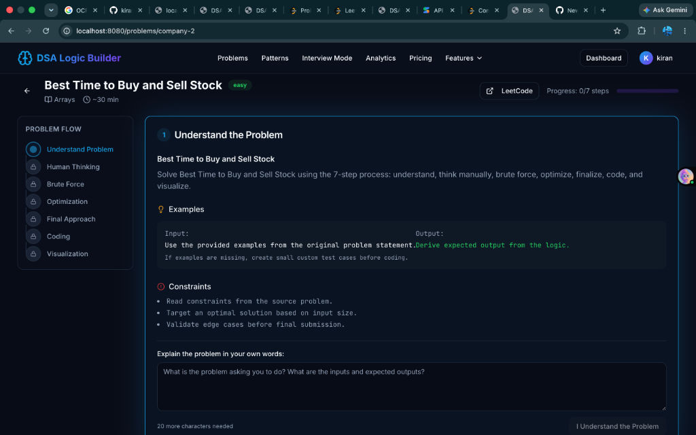
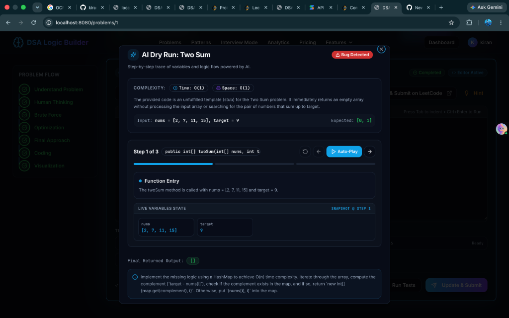

# 🧠 DSA Logic Builder

<div align="center">

[](https://reactjs.org/)
[](https://www.typescriptlang.org/)
[](https://vitejs.dev/)
[](https://tailwindcss.com/)
[](https://nodejs.org/)
[](https://expressjs.com/)
[](https://www.mysql.com/)
[](https://aistudio.google.com/)
[](LICENSE)

<br/>

**Transform algorithmic problem-solving from rote memorization into deep, intuitive logic.**  
*A modern full-stack web application designed to guide developers step-by-step through algorithmic thinking, dynamic visual simulations, and AI-powered execution traces.*

<br/>

<p align="center">
  
</p>

<br/>

[🌟 7-Step Framework](#-feature-spotlight-1-the-7-step-dsa-mastery-framework) • [🤖 AI Dry Run](#-feature-spotlight-2-ai-powered-code-dry-run-engine) • [Quickstart](#-getting-started) • [API Reference](#-api-endpoints) • [Deployment](#-deployment)

</div>

---

## 🌟 Why DSA Logic Builder?

Most competitive programmers and interview candidates struggle not because they lack programming syntax, but because they **jump straight to code without understanding the underlying thought process**.

When faced with an unseen problem in high-stakes technical interviews, rushing into syntax causes:
- ❌ **Syntax panic** and blanking out.
- ❌ **Off-by-one errors** and unhandled edge cases.
- ❌ **Suboptimal brute-force solutions** that trigger Time Limit Exceeded (TLE).

**DSA Logic Builder** solves this through two signature pillars:
1. **The 7-Step Problem-Solving Ladder** — A disciplined, sequential thinking framework.
2. **AI-Powered Code Dry Run (Google Gemini)** — Real-time line-by-line simulation of your code showing live variable snapshots, bug detection, and complexity analysis.

---

## 🎯 Feature Spotlight 1: The 7-Step DSA Mastery Framework

Every single problem is broken down into structured, bite-sized cognitive stages. You master the logic before writing a single line of code.

<p align="center">
  
</p>

| Step | Stage Name | What Happens | Why It Matters |
| :---: | :--- | :--- | :--- |
| **1** | **Understand the Problem** | Extract input/output types, numeric constraints, and explain the problem in your own words. | Prevents solving the wrong problem or misunderstanding constraints. |
| **2** | **Human Thinking** | Work through concrete small examples manually using pen-and-paper logic. | Uncovers the natural intuition humans use to solve the pattern. |
| **3** | **Brute Force** | Formulate the naive solution, determine theoretical time/space bounds ($O(n^2)$ / $O(2^n)$), and identify bottlenecks. | Gives a guaranteed baseline solution and identifies redundant computations. |
| **4** | **Optimization** | Discover algorithmic patterns (Two Pointers, Hash Map, Sliding Window, Monotonic Stack, DP). | Teaches pattern recognition across 15+ core algorithmic archetypes. |
| **5** | **Final Approach** | Write structured pseudocode, establish loop invariants, and confirm time/space complexity. | Creates an airtight algorithmic blueprint before touching syntax. |
| **6** | **Coding Step & AI Dry Run** | Implement in Python 3, JavaScript, Java, or C++ with test cases, code persistence, and live AI dry run. | Writes clean, verified code with instant bug detection. |
| **7** | **Visualization** | Watch animated data structure simulations showing pointer movements, arrays, and trees. | Solidifies spatial memory of how data structures behave dynamically. |

---

## 🤖 Feature Spotlight 2: AI-Powered Code Dry Run Engine

Writing code is only half the battle — understanding *how it executes* is where mastery happens. The **AI Dry Run** feature simulates your code in real-time using **Google Gemini AI (`gemini-3.6-flash`)**.

<p align="center">
  
</p>

### Key Capabilities of the AI Dry Run Visualizer:
- **📊 Live Variables State Inspector**: An interactive snapshot table showing the exact values of all variables, pointers, counters, and hash maps at every single loop iteration.
- **⏯️ Interactive Step Player**: Step through code at your own pace with **Previous Step**, **Next Step**, **Auto-Play**, and **Reset** controls.
- **🚨 Automated Bug & Edge-Case Detection**:
  - Automatically identifies unfulfilled stubs, missing returns, off-by-one errors, and incorrect indexing.
  - Displays a prominent **`Bug Detected`** badge with specific, actionable suggestions on how to fix the logic.
- **⚡ Complexity Verification**: Real-time evaluation of both **Time Complexity** ($O$) and **Space Complexity** ($O$) based on your code's loops and allocations.
- **💡 Concrete Explanations**: Plain-English rationale detailing what each line accomplishes and why state changes occurred.
- **🚀 One-Click LeetCode Export**: Copies your verified code to your clipboard and opens the exact problem page on LeetCode in a new tab.

---

## 📖 Complete Learning Workflow

```
┌─────────────────────────┐
│ 1. Select Problem Track │
│ Company (Google/Meta)   │
│ Or Algorithmic Pattern  │
└───────────┬─────────────┘
            ▼
┌─────────────────────────┐
│ 2. Ascend 7-Step Ladder │
│ Understand ➔ Intuition  │
│ ➔ Brute Force ➔ Optimize│
└───────────┬─────────────┘
            ▼
┌─────────────────────────┐
│ 3. Multi-Language Code  │
│ Python, JS, Java, C++   │
└───────────┬─────────────┘
            ▼
┌─────────────────────────┐     ┌────────────────────────┐
│ 4. Run AI Dry Run       │ ──▶ │ 5. Visualizer & Save   │
│ Live Variables & Gemini │     │ Progress saved in MySQL│
└─────────────────────────┘     └────────────────────────┘
```

1. **Pick a Track**: Choose problems by pattern (*Two Pointers*, *Sliding Window*, *Dynamic Programming*) or by top tech companies (*Google*, *Amazon*, *Meta*, *Microsoft*, *Apple*, *Uber*).
2. **Solve Step-by-Step**: Walk through Steps 1 to 5 to plan your strategy.
3. **Code & Trace**: Write your code in Step 6 and click **`✨ AI Dry Run`** to verify variable mutations and check for bugs.
4. **Visualize**: Watch step 7 to see animated pointers and array operations.
5. **Track Consistency**: Solutions, completion states, and streak dates are automatically persisted to your MySQL database. Review them anytime via the **Activity Heatmap** or **Spaced Repetition Dashboard**.

---

## 🛠️ Architecture & Tech Stack

```
┌─────────────────────────────────────────────────────────────┐
│                    Frontend (Vite + React)                  │
│   Tailwind CSS • shadcn/ui • Radix UI • Lucide • TypeScript  │
└──────────────────────────────┬──────────────────────────────┘
                               │ REST API (JSON / JWT)
┌──────────────────────────────▼──────────────────────────────┐
│                  Backend (Node.js + Express)                │
│    Helmet Security • Express Rate Limit • JWT Auth • CORS   │
└──────────────┬──────────────────────────────┬───────────────┘
               │                              │
               ▼                              ▼
┌──────────────────────────────┐ ┌────────────────────────────┐
│      MySQL Database          │ │     Google Gemini AI       │
│  Users • Progress • Streaks  │ │  gemini-3.6-flash Engine   │
│   Roles • Code Solutions     │ │  Live Execution Simulator  │
└──────────────────────────────┘ └────────────────────────────┘
```

| Layer | Technology | Description |
| :--- | :--- | :--- |
| **Frontend** | React 18, TypeScript, Vite | Ultra-fast Single Page Application (SPA) |
| **Styling** | Tailwind CSS, shadcn/ui | Dark/light accessible design system |
| **Backend** | Node.js, Express.js | Secure RESTful API service |
| **Database** | MySQL 8.0+ | Relational schema with transactional consistency |
| **Authentication** | JSON Web Tokens (JWT), bcryptjs | Secure password hashing (12 salt rounds) |
| **AI Engine** | Google Gemini (`gemini-3.6-flash`) | Context-aware code execution and dry run simulation |

---

## 🏁 Getting Started

### Prerequisites
- **Node.js**: v18.0.0 or higher
- **npm**: v9.0.0 or higher
- **MySQL**: 8.0+ (local instance or cloud database like Railway/Aiven)

---

### 1. Clone the Repository

```bash
git clone https://github.com/YOUR_USERNAME/dsa-logic-builder.git
cd dsa-logic-builder
```

### 2. Install Dependencies

```bash
# Install frontend dependencies
npm install

# Install backend dependencies
cd server && npm install && cd ..
```

---

### 3. Configure Environment Variables

#### Backend (`server/.env`)
Create `server/.env` (or copy from `server/.env.example`):

```env
# MySQL Database Configuration
MYSQL_HOST=localhost
MYSQL_PORT=3306
MYSQL_USER=root
MYSQL_PASSWORD=your_mysql_password
MYSQL_DATABASE=dsa_logic_builder

# Authentication Secret (Change for production)
JWT_SECRET=your-random-secret-key-change-in-production

# Server Port & CORS
PORT=3001
CORS_ORIGIN=http://localhost:8080

# Google Gemini AI (for live AI dry runs)
# Get a free API key at: https://aistudio.google.com/app/apikey
GEMINI_API_KEY=your_gemini_api_key_here
```

#### Frontend (`.env.local` - Optional)
```env
VITE_API_URL=http://localhost:3001
```

---

### 4. Initialize the MySQL Database

Run the automated setup script to create database tables:

```bash
node server/setup-db.js
```

---

### 5. Launch the Application

Run both frontend and backend concurrently:

```bash
npm run dev:all
```

- **Frontend Application**: `http://localhost:8080`
- **Express API Server**: `http://localhost:3001`
- **API Health Check**: `http://localhost:3001/api/health`

---

## 📡 API Endpoints

### Authentication (`/api/auth`)
| Method | Endpoint | Description | Auth Required |
| :--- | :--- | :--- | :---: |
| `POST` | `/api/auth/signup` | Register a new user | No |
| `POST` | `/api/auth/login` | Authenticate and receive JWT | No |
| `GET` | `/api/auth/me` | Retrieve active user profile | Yes |
| `PUT` | `/api/auth/update-password` | Update current password | Yes |

### Problem Progress (`/api/progress`)
| Method | Endpoint | Description | Auth Required |
| :--- | :--- | :--- | :---: |
| `GET` | `/api/progress` | Get all solved problem records | Yes |
| `GET` | `/api/progress/:problemId` | Get progress for a specific problem | Yes |
| `PUT` | `/api/progress/:problemId` | Save step completion & code solution | Yes |

### AI Dry Run Engine (`/api/ai`)
| Method | Endpoint | Description | Auth Required |
| :--- | :--- | :--- | :---: |
| `POST` | `/api/ai/dryrun` | Perform AI line-by-line simulation & trace | No |

### Streaks & Profiles (`/api/streaks`, `/api/profiles`)
| Method | Endpoint | Description | Auth Required |
| :--- | :--- | :--- | :---: |
| `GET` | `/api/streaks` | Get current user's streak count & history | Yes |
| `POST` | `/api/streaks/checkin` | Record daily activity check-in | Yes |
| `PUT` | `/api/profiles` | Update display name or preferences | Yes |
| `POST` | `/api/profiles/avatar` | Upload profile image (multipart/form-data) | Yes |

---

## 🚀 Deployment

### 1. Deploy Backend & MySQL Database (Railway or Render)
1. Provision a MySQL 8.0 instance on [Railway](https://railway.app) or [Aiven](https://aiven.io).
2. Execute `server/schema.sql` against the database to create all tables.
3. Deploy the `/server` directory to Railway or Render:
   - **Root Directory**: `server`
   - **Start Command**: `node index.js`
   - **Environment Variables**: Add your database credentials, `JWT_SECRET`, `GEMINI_API_KEY`, and set `CORS_ORIGIN` to your frontend domain.

### 2. Deploy Frontend (Vercel)
1. Import your GitHub repository to [Vercel](https://vercel.com).
2. Configure:
   - **Framework Preset**: `Vite`
   - **Root Directory**: `./`
   - **Environment Variable**: `VITE_API_URL=https://your-backend-api.railway.app`
3. Click **Deploy**.

---

## 📂 Project Structure

```
dsa-logic-builder/
├── docs/                   # Documentation and screenshots
│   └── screenshots/        # Real application preview images
│       ├── ai_dryrun.png
│       └── problem_flow_7step.png
├── public/                 # Static assets and icons
├── server/                 # Express backend
│   ├── middleware/         # JWT authentication and RBAC guards
│   ├── routes/             # Auth, AI Dry Run, Progress, Streaks, Profiles
│   ├── db.js               # MySQL connection pool
│   ├── schema.sql          # Full database schema and indexes
│   ├── setup-db.js         # Automated schema initializer
│   └── index.js            # Express server entry point
├── src/
│   ├── components/
│   │   ├── features/       # Heatmaps, timers, notes, forums, contests
│   │   ├── layout/         # Responsive Navbar, Footer, Page Layouts
│   │   ├── problem/        # 7-Step logic components & DryRunModal
│   │   └── ui/             # Radix UI + Tailwind design components
│   ├── contexts/           # Authentication and subscription state
│   ├── data/               # Curated problems and company tracks
│   ├── hooks/              # Custom hooks (progress, streaks, bookmarks)
│   ├── lib/                # API client, local storage, utilities
│   ├── pages/              # Problem Solving, Dashboard, Analytics, Auth
│   ├── App.tsx             # Route definitions and error boundary
│   └── main.tsx            # Application entry point
├── vercel.json             # Vercel SPA rewrites & security headers
├── tailwind.config.ts      # Design system color tokens and typography
└── vite.config.ts          # Vite build optimization
```

---

## 🤝 Contributing

Contributions make the open-source community an amazing place to learn, inspire, and create. Any contributions you make are **greatly appreciated**!

1. Fork the Project
2. Create your Feature Branch (`git checkout -b feature/AmazingFeature`)
3. Commit your Changes (`git commit -m 'feat: Add some AmazingFeature'`)
4. Push to the Branch (`git push origin feature/AmazingFeature`)
5. Open a Pull Request

---

## 📄 License

Distributed under the **MIT License**. See [`LICENSE`](LICENSE) for more information.

---

<div align="center">

Built with ❤️ for passionate problem solvers. If you find this project helpful, don't forget to **Star ⭐ this repository**!

</div>
